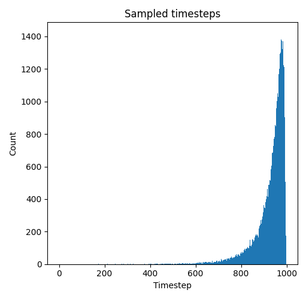
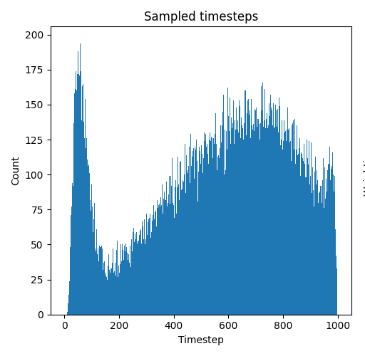
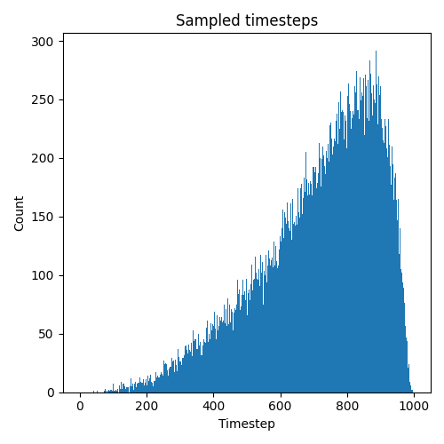
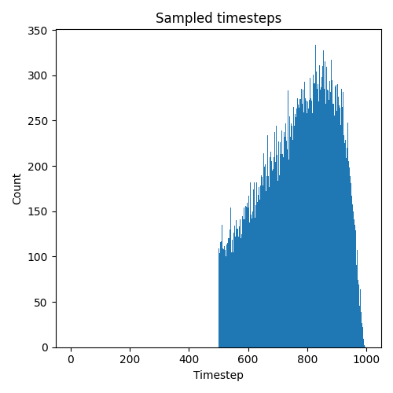

> 📝 Click on the language section to expand / 言語をクリックして展開

# Advanced configuration / 高度な設定

## Table of contents / 目次

- [Using configuration files to specify training options](#using-configuration-files-to-specify-training-options--設定ファイルを使用した学習オプションの指定)
- [How to specify `network_args`](#how-to-specify-network_args--network_argsの指定方法)
- [LoRA+](#lora)
- [Select the target modules of LoRA](#select-the-target-modules-of-lora--loraの対象モジュールを選択する)
- [Save and view logs in TensorBoard format](#save-and-view-logs-in-tensorboard-format--tensorboard形式のログの保存と参照)
- [Save and view logs in wandb](#save-and-view-logs-in-wandb--wandbでログの保存と参照)
- [FP8 weight optimization for models](#fp8-weight-optimization-for-models--モデルの重みのfp8への最適化)
- [PyTorch Dynamo optimization for model training](#pytorch-dynamo-optimization-for-model-training--モデルの学習におけるpytorch-dynamoの最適化)
- [MagCache](#magcache)
- [Style-Friendly SNR Sampler](#style-friendly-snr-sampler)
- [Specify time step range for training](#specify-time-step-range-for-training--学習時のタイムステップ範囲の指定)
- [Timestep Bucketing for Uniform Sampling](#timestep-bucketing-for-uniform-sampling--均一なサンプリングのためのtimestep-bucketing)
- [Schedule Free Optimizer](#schedule-free-optimizer--スケジュールフリーオプティマイザ)

[Post-Hoc EMA merging for LoRA](tools.md#lora-post-hoc-ema-merging--loraのpost-hoc-emaマージ) is described in the [Tools](tools.md) document.

## Using configuration files to specify training options / 設定ファイルを使用した学習オプションの指定

Instead of specifying all training options on the command line, you can use a `.toml` configuration file to specify them. This can make it easier to manage and reuse training configurations.

Specify the configuration file with the `--config_file` option. The `.toml` extension can be omitted.

```bash
accelerate launch --num_cpu_threads_per_process 1 --mixed_precision bf16 src/musubi_tuner/hv_train_network.py --config_file config.toml
```

The configuration file is a TOML file that can contain any of the command-line options. The file can be organized into sections for readability, but all sections are flattened when parsed, so the section names are ignored.

<details>
<summary>日本語</summary>

すべての学習オプションをコマンドラインで指定する代わりに、`.toml`設定ファイルを使用して指定することができます。これにより、学習設定の管理や再利用が容易になります。

`--config_file`オプションで設定ファイルを指定します。`.toml`拡張子は省略できます。

```bash
accelerate launch --num_cpu_threads_per_process 1 --mixed_precision bf16 src/musubi_tuner/hv_train_network.py --config_file config.toml
```

設定ファイルは、コマンドラインオプションのいずれかを含むことができるTOMLファイルです。ファイルは読みやすさのためにセクションに分けることができますが、解析時にすべてのセクションがフラット化されるため、セクション名は無視されます。

</details>

### Example configuration file / 設定ファイルの例

```toml
# config.toml
dit = "/path/to/dit"
dataset_config = "/path/to/dataset.toml"
network_module = "networks.lora"
network_dim = 32
network_alpha = 16

[optimizer]
optimizer_type = "AdamW"
learning_rate = 1e-4

[training]
max_train_epochs = 10
save_every_n_epochs = 2
mixed_precision = "bf16"

[output]
output_dir = "/path/to/output"
output_name = "my_lora"
logging_dir = "./logs"
```

All options can be specified in the top level or within sections. When parsed, the section structure is ignored and all key-value pairs are combined into a single namespace.

Options specified on the command line will override those in the configuration file.

```bash
# This will use the config file but override the learning_rate
accelerate launch --mixed_precision bf16 src/musubi_tuner/hv_train_network.py --config_file config --learning_rate 2e-4
```

<details>
<summary>日本語</summary>

すべてのオプションは、トップレベルまたはセクション内に指定できます。解析時には、セクション構造は無視され、すべてのキーと値のペアが単一のネームスペースに結合されます。

コマンドラインで指定されたオプションは、設定ファイルのオプションを上書きします。

```bash
# 設定ファイルを使用しますが、learning_rateを上書きします
accelerate launch --mixed_precision bf16 src/musubi_tuner/hv_train_network.py --config_file config --learning_rate 2e-4
```

</details>

## How to specify `network_args` / `network_args`の指定方法

The `--network_args` option is an option for specifying detailed arguments to LoRA. Specify the arguments in the form of `key=value` in `--network_args`.

<details>
<summary>日本語</summary>
`--network_args`オプションは、LoRAへの詳細な引数を指定するためのオプションです。`--network_args`には、`key=value`の形式で引数を指定します。
</details>

### Example / 記述例

If you specify it on the command line, write as follows. / コマンドラインで指定する場合は以下のように記述します。

```bash
accelerate launch --num_cpu_threads_per_process 1 --mixed_precision bf16 src/musubi_tuner/hv_train_network.py --dit ... 
    --network_module networks.lora --network_dim 32 
    --network_args "key1=value1" "key2=value2" ...
```

If you specify it in the configuration file, write as follows. / 設定ファイルで指定する場合は以下のように記述します。

```toml
network_args = ["key1=value1", "key2=value2", ...]
```

If you specify `"verbose=True"`, detailed information of LoRA will be displayed. / `"verbose=True"`を指定するとLoRAの詳細な情報が表示されます。

```bash
--network_args "verbose=True" "key1=value1" "key2=value2" ...
```

## LoRA+

LoRA+ is a method to improve the training speed by increasing the learning rate of the UP side (LoRA-B) of LoRA. Specify the multiplier for the learning rate. The original paper recommends 16, but adjust as needed. It seems to be good to start from around 4. For details, please refer to the [related PR of sd-scripts](https://github.com/kohya-ss/sd-scripts/pull/1233).

Specify `loraplus_lr_ratio` with `--network_args`.

<details>
<summary>日本語</summary>

LoRA+は、LoRAのUP側（LoRA-B）の学習率を上げることで学習速度を向上させる手法です。学習率に対する倍率を指定します。元論文では16を推奨していますが、必要に応じて調整してください。4程度から始めるとよいようです。詳細は[sd-scriptsの関連PR]https://github.com/kohya-ss/sd-scripts/pull/1233)を参照してください。

`--network_args`で`loraplus_lr_ratio`を指定します。
</details>

### Example / 記述例

```bash
accelerate launch --num_cpu_threads_per_process 1 --mixed_precision bf16 src/musubi_tuner/hv_train_network.py --dit ... 
    --network_module networks.lora --network_dim 32 --network_args "loraplus_lr_ratio=4" ...
```

## Select the target modules of LoRA / LoRAの対象モジュールを選択する

*This feature is highly experimental and the specification may change. / この機能は特に実験的なもので、仕様は変更される可能性があります。*

By specifying `exclude_patterns` and `include_patterns` with `--network_args`, you can select the target modules of LoRA.

`exclude_patterns` excludes modules that match the specified pattern. `include_patterns` targets only modules that match the specified pattern.

Specify the values as a list. For example, `"exclude_patterns=[r'.*single_blocks.*', r'.*double_blocks\.[0-9]\..*']"`.

The pattern is a regular expression for the module name. The module name is in the form of `double_blocks.0.img_mod.linear` or `single_blocks.39.modulation.linear`. The regular expression is not a partial match but a complete match.

The patterns are applied in the order of `exclude_patterns`→`include_patterns`. By default, the Linear layers of `img_mod`, `txt_mod`, and `modulation` of double blocks and single blocks are excluded.

(`.*(img_mod|txt_mod|modulation).*` is specified.)

<details>
<summary>日本語</summary>

`--network_args`で`exclude_patterns`と`include_patterns`を指定することで、LoRAの対象モジュールを選択することができます。

`exclude_patterns`は、指定したパターンに一致するモジュールを除外します。`include_patterns`は、指定したパターンに一致するモジュールのみを対象とします。

値は、リストで指定します。`"exclude_patterns=[r'.*single_blocks.*', r'.*double_blocks\.[0-9]\..*']"`のようになります。

パターンは、モジュール名に対する正規表現です。モジュール名は、たとえば`double_blocks.0.img_mod.linear`や`single_blocks.39.modulation.linear`のような形式です。正規表現は部分一致ではなく完全一致です。

パターンは、`exclude_patterns`→`include_patterns`の順で適用されます。デフォルトは、double blocksとsingle blocksのLinear層のうち、`img_mod`、`txt_mod`、`modulation`が除外されています。

（`.*(img_mod|txt_mod|modulation).*`が指定されています。）
</details>

### Example / 記述例

Only the modules of double blocks / double blocksのモジュールのみを対象とする場合:

```bash
--network_args "exclude_patterns=[r'.*single_blocks.*']"
```

Only the modules of single blocks from the 10th / single blocksの10番目以降のLinearモジュールのみを対象とする場合:

```bash
--network_args "exclude_patterns=[r'.*']" "include_patterns=[r'.*single_blocks\.\d{2}\.linear.*']"
```

## Save and view logs in TensorBoard format / TensorBoard形式のログの保存と参照

Specify the folder to save the logs with the `--logging_dir` option. Logs in TensorBoard format will be saved.

For example, if you specify `--logging_dir=logs`, a `logs` folder will be created in the working folder, and logs will be saved in the date folder inside it.

Also, if you specify the `--log_prefix` option, the specified string will be added before the date. For example, use `--logging_dir=logs --log_prefix=lora_setting1_` for identification.

To view logs in TensorBoard, open another command prompt and activate the virtual environment. Then enter the following in the working folder.

```powershell
tensorboard --logdir=logs
```

(tensorboard installation is required.)

Then open a browser and access http://localhost:6006/ to display it.

<details>
<summary>日本語</summary>
`--logging_dir`オプションにログ保存先フォルダを指定してください。TensorBoard形式のログが保存されます。

たとえば`--logging_dir=logs`と指定すると、作業フォルダにlogsフォルダが作成され、その中の日時フォルダにログが保存されます。

また`--log_prefix`オプションを指定すると、日時の前に指定した文字列が追加されます。`--logging_dir=logs --log_prefix=lora_setting1_`などとして識別用にお使いください。

TensorBoardでログを確認するには、別のコマンドプロンプトを開き、仮想環境を有効にしてから、作業フォルダで以下のように入力します。

```powershell
tensorboard --logdir=logs
```

（tensorboardのインストールが必要です。）

その後ブラウザを開き、http://localhost:6006/ へアクセスすると表示されます。
</details>

## Save and view logs in wandb / wandbでログの保存と参照

`--log_with wandb` option is available to save logs in wandb format. `tensorboard` or `all` is also available. The default is `tensorboard`.

Specify the project name with `--log_tracker_name` when using wandb.

<details>
<summary>日本語</summary>
`--log_with wandb`オプションを指定するとwandb形式でログを保存することができます。`tensorboard`や`all`も指定可能です。デフォルトは`tensorboard`です。

wandbを使用する場合は、`--log_tracker_name`でプロジェクト名を指定してください。
</details>

## FP8 weight optimization for models / モデルの重みのFP8への最適化

The `--fp8_scaled` option performs an offline optimization pass that rewrites selected Linear weights into FP8 (E4M3) with block-wise scaling. Compared with the legacy `--fp8` cast, it reduces VRAM usage while maintaining relatively high precision.

From v0.2.12, block-wise scaling is supported instead of per-tensor scaling, allowing for higher precision quantization.

This flow dequantizes back the weights to the FP16/BF16/FP32 weights during the forward path, and computes in FP16/BF16/FP32. The shared routines live in `src/musubi_tuner/modules/fp8_optimization_utils.py` and are wired into the Wan2.x, FramePack, FLUX.1 Kontext, and Qwen-Image pipelines (except HunyuanVideo, which `--fp8_scaled` is not supported).

Acknowledgments: This idea is based on the [implementation](https://github.com/Tencent/HunyuanVideo/blob/7df4a45c7e424a3f6cd7d653a7ff1f60cddc1eb1/hyvideo/modules/fp8_optimization.py) of [HunyuanVideo](https://github.com/Tencent/HunyuanVideo). The selection of high-precision modules is referenced from the [implementation](https://github.com/tdrussell/diffusion-pipe/blob/407c04fdae1c9ab5e67b54d33bef62c3e0a8dbc7/models/wan.py) of [diffusion-pipe](https://github.com/tdrussell/diffusion-pipe). I would like to thank these repositories.

<details>
<summary>日本語</summary>

`--fp8_scaled` オプションは、対象の Linear 層の重みを、blockごとに適切な倍率でスケーリングした FP8 (E4M3) に書き換える前処理を実行します。従来の `--fp8` による単純なキャストと比べて、元の精度を比較的保ったまま VRAM を削減できます。

v0.2.12から、テンソルごとのスケーリングではなく、ブロック単位のスケーリングに対応しました。これにより、より高い精度での量子化が可能になります。

forward の計算は、逆量子化を行なった重みで FP16/BF16 で行われます。共通ルーチンは `src/musubi_tuner/modules/fp8_optimization_utils.py` にあり、Wan 2.x・FramePack・FLUX.1 Kontext・Qwen-Image の各パイプラインで利用されます（HunyuanVideo については `--fp8_scaled` オプションは無効です）。

このアイデアは、[HunyuanVideo](https://github.com/Tencent/HunyuanVideo) の [実装](https://github.com/Tencent/HunyuanVideo/blob/7df4a45c7e424a3f6cd7d653a7ff1f60cddc1eb1/hyvideo/modules/fp8_optimization.py) に基づいています。高精度モジュールの選定は、[diffusion-pipe](https://github.com/tdrussell/diffusion-pipe) の [実装](https://github.com/tdrussell/diffusion-pipe/blob/407c04fdae1c9ab5e67b54d33bef62c3e0a8dbc7/models/wan.py) を参考にしています。これらのリポジトリに感謝します。

</details>

### Usage summary / 使い方のまとめ

- Inference: add `--fp8` and `--fp8_scaled` when running `wan_generate_video.py`, `fpack_generate_video.py`, `flux_kontext_generate_image.py`, or `qwen_image_generate_image.py`. HunyuanVideo continues to rely on `--fp8`/`--fp8_fast` without scaled weights.
- Training: specify `--fp8_base --fp8_scaled` in `wan_train_network.py`, `fpack_train_network.py`,`flux_kontext_train_network.py` and `qwen_image_train_network.py`; the trainers enforce this pairing.
- Input checkpoints must be FP16/BF16; pre-quantized FP8 weights cannot be re-optimized.
- LoRA / LyCORIS weights are merged before quantization, so no additional steps are required.

<details>
<summary>日本語</summary>

- 推論では `wan_generate_video.py`、`fpack_generate_video.py`、`flux_kontext_generate_image.py`、`qwen_image_generate_image.py` を実行する際に `--fp8` と `--fp8_scaled` を併用してください。HunyuanVideo は引き続き`--fp8` / `--fp8_fast` を使用し、スケーリング付き重みは未対応です。
- 学習では `wan_train_network.py`、`fpack_train_network.py`、`flux_kontext_train_network.py` で `--fp8_base --fp8_scaled` を指定します。
- 読み込むチェックポイントは FP16/BF16 である必要があります。あらかじめ FP8 化された重みは再最適化できません。
- LoRA / LyCORIS の重みは量子化の前に自動でマージされるため、追加作業は不要です。

</details>

### Implementation highlights / 実装のポイント


When `--fp8_scaled` flag is enabled, the loader loads the base weights in FP16/BF16, merges optional LoRA or LyCORIS, and then emits FP8 weights plus matching block-wise `.scale_weight` buffers for the targeted layers. The patched forward either dequantizes back to the original dtype on demand for computation.

The current scripts in this repository use FP8 E4M3 format and block-wise quantization, but the implementation supports:

- Implements FP8 (E4M3 or E5M2) weight quantization for Linear layers
- Supports multiple quantization modes: tensor-wise, channel-wise, and block-wise quantization described below
- Block-wise quantization provides better precision by using granular scaling with configurable block size (default: 64)
- Reduces VRAM requirements by using 8-bit weights for storage (slightly increased compared to existing `--fp8` `--fp8_base` options)
- Quantizes weights to FP8 format with appropriate scaling instead of simple cast to FP8
- Applies monkey patching to Linear layers for transparent dequantization during computation
- Maintains computational precision by dequantizing to original precision (FP16/BF16) during forward pass
- Preserves important weights for example norm, embedding, modulation in FP16/BF16 format (fewer exclusions than previous versions)

For quantization and precision discussion, see also [Discussion #564](https://github.com/kohya-ss/musubi-tuner/discussions/564).

Note: Testing for quantization other than E4M3/block-wise is limited, so please be cautious if you plan to use the code in other projects.

<details>
<summary>日本語</summary>

`--fp8_scaled` フラグを有効にすると、ローダーはまずベースとなる重みを FP16/BF16 のまま読み込み、必要に応じて LoRA や LyCORIS をマージした後、対象層の重みを FP8 の重みと、ブロックごとの `.scale_weight` バッファへ変換します。forward ではこのスケールを使って元の精度へ動的に逆量子化し計算を行います。

このリポジトリの現在のスクリプトでは、量子化はFP8 E4M3形式、ブロック単位量子化が用いられていますが、実装としては以下をサポートしています：

- Linear層のFP8（E4M3またはE5M2）重み量子化を実装
- 複数の量子化モード対応：テンソル単位、チャネル単位、ブロック単位量子化
- ブロック単位量子化は指定したブロックサイズ（デフォルト：64）での細粒度スケーリングによりより高い精度を提供
- 8ビットの重みを使用することでVRAM使用量を削減（既存の`--fp8` `--fp8_base` オプションに比べて微増）
- 単純なFP8へのcastではなく、適切な値でスケールして重みをFP8形式に量子化
- Linear層にmonkey patchingを適用し、計算時に透過的に逆量子化
- forward時に元の精度（FP16/BF16）に逆量子化して計算精度を維持
- 精度が重要な重み、たとえばnormやembedding、modulationは、FP16/BF16のまま保持（従来バージョンより除外対象を削減）

量子化と精度については[Discussion #564](https://github.com/kohya-ss/musubi-tuner/discussions/564)も参照してください。

※E4M3/ブロック単位以外の量子化のテストは不十分ですので、コードを他のプロジェクトで利用する場合等には注意してください。

</details>

### Quantization modes / 量子化モード

The current implementation supports three quantization modes:

- **Block-wise quantization (default)**: Divides weight matrices into blocks of configurable size (default: 64) and calculates separate scale factors for each block. Provides the best precision but requires more memory for scale storage.
- **Channel-wise quantization**: Calculates scale factors per output channel (row). Balances precision and memory usage.
- **Tensor-wise quantization**: Uses a single scale factor for the entire weight tensor. Lowest memory usage but may have reduced precision for some weights.

The implementation automatically falls back to simpler modes when block-wise quantization is not feasible (e.g., when weight dimensions are not divisible by block size).

<details>
<summary>日本語</summary>

現在の実装では3つの量子化モードをサポートしています：

- **ブロック単位量子化（デフォルト）**：重み行列を設定可能なサイズのブロック（デフォルト：64）に分割し、各ブロックに対して個別のスケール係数を計算します。最高の精度を提供しますが、スケール保存により追加メモリが必要です。
- **チャネル単位量子化**：出力チャネル（行）ごとにスケール係数を計算します。精度とメモリ使用量のバランスを取ります。
- **テンソル単位量子化**：重みテンソル全体に対して単一のスケール係数を使用します。最も少ないメモリ使用量ですが、一部の重みで精度が低下する場合があります。

実装では、ブロック単位量子化が実行不可能な場合（重み次元がブロックサイズで割り切れない場合など）、自動的により単純なモードにフォールバックします。

</details>

 ## PyTorch Dynamo optimization for model training / モデルの学習におけるPyTorch Dynamoの最適化

The PyTorch Dynamo options are now available to optimize the training process. PyTorch Dynamo is a Python-level JIT compiler designed to make unmodified PyTorch programs faster by using TorchInductor, a deep learning compiler. This integration allows for potential speedups in training while maintaining model accuracy.

[PR #215](https://github.com/kohya-ss/musubi-tuner/pull/215) added this feature.

Specify the `--dynamo_backend` option to enable Dynamo optimization with one of the available backends from the `DynamoBackend` enum.

Additional options allow for fine-tuning the Dynamo behavior:
- `--dynamo_mode`: Controls the optimization strategy
- `--dynamo_fullgraph`: Enables fullgraph mode for potentially better optimization
- `--dynamo_dynamic`: Enables dynamic shape handling

The `--dynamo_dynamic` option has been reported to have many problems based on the validation in PR #215.

### Available options:

```
--dynamo_backend {NO, INDUCTOR, NVFUSER, CUDAGRAPHS, CUDAGRAPHS_FALLBACK, etc.}
    Specifies the Dynamo backend to use (default is NO, which disables Dynamo)

--dynamo_mode {default, reduce-overhead, max-autotune}
    Specifies the optimization mode (default is 'default')
    - 'default': Standard optimization
    - 'reduce-overhead': Focuses on reducing compilation overhead
    - 'max-autotune': Performs extensive autotuning for potentially better performance

--dynamo_fullgraph
    Flag to enable fullgraph mode, which attempts to capture and optimize the entire model graph

--dynamo_dynamic
    Flag to enable dynamic shape handling for models with variable input shapes
```

### Usage example:

```bash
python src/musubi_tuner/hv_train_network.py --dynamo_backend INDUCTOR --dynamo_mode default
```

For more aggressive optimization:
```bash
python src/musubi_tuner/hv_train_network.py --dynamo_backend INDUCTOR --dynamo_mode max-autotune --dynamo_fullgraph
```

Note: The best combination of options may depend on your specific model and hardware. Experimentation may be necessary to find the optimal configuration.

<details>
<summary>日本語</summary>
PyTorch Dynamoオプションが学習プロセスを最適化するために追加されました。PyTorch Dynamoは、TorchInductor（ディープラーニングコンパイラ）を使用して、変更を加えることなくPyTorchプログラムを高速化するためのPythonレベルのJITコンパイラです。この統合により、モデルの精度を維持しながら学習の高速化が期待できます。

[PR #215](https://github.com/kohya-ss/musubi-tuner/pull/215) で追加されました。

`--dynamo_backend`オプションを指定して、`DynamoBackend`列挙型から利用可能なバックエンドの一つを選択することで、Dynamo最適化を有効にします。

追加のオプションにより、Dynamoの動作を微調整できます：
- `--dynamo_mode`：最適化戦略を制御します
- `--dynamo_fullgraph`：より良い最適化の可能性のためにフルグラフモードを有効にします
- `--dynamo_dynamic`：動的形状処理を有効にします

PR #215での検証によると、`--dynamo_dynamic`には問題が多いことが報告されています。

__利用可能なオプション：__

```
--dynamo_backend {NO, INDUCTOR, NVFUSER, CUDAGRAPHS, CUDAGRAPHS_FALLBACK, など}
    使用するDynamoバックエンドを指定します（デフォルトはNOで、Dynamoを無効にします）

--dynamo_mode {default, reduce-overhead, max-autotune}
    最適化モードを指定します（デフォルトは 'default'）
    - 'default'：標準的な最適化
    - 'reduce-overhead'：コンパイルのオーバーヘッド削減に焦点を当てる
    - 'max-autotune'：より良いパフォーマンスのために広範な自動調整を実行

--dynamo_fullgraph
    フルグラフモードを有効にするフラグ。モデルグラフ全体をキャプチャして最適化しようとします

--dynamo_dynamic
    可変入力形状を持つモデルのための動的形状処理を有効にするフラグ
```

__使用例：__

```bash
python src/musubi_tuner/hv_train_network.py --dynamo_backend INDUCTOR --dynamo_mode default
```

より積極的な最適化の場合：
```bash
python src/musubi_tuner/hv_train_network.py --dynamo_backend INDUCTOR --dynamo_mode max-autotune --dynamo_fullgraph
```

注意：最適なオプションの組み合わせは、特定のモデルとハードウェアに依存する場合があります。最適な構成を見つけるために実験が必要かもしれません。
</details>

## MagCache

The following is quoted from the [MagCache github repository](https://github.com/Zehong-Ma/MagCache) "Magnitude-aware Cache (MagCache) for Video Diffusion Models":

> We introduce Magnitude-aware Cache (MagCache), a training-free caching approach that estimates and leverages the fluctuating differences among model outputs across timesteps based on the robust magnitude observations, thereby accelerating the inference. MagCache works well for Video Diffusion Models, Image Diffusion models. 

We have implemented the MagCache feature in Musubi Tuner. Some of the code is based on the MagCache repository. It is available for `fpack_generate_video.py` for now.

### Usage

1. Calibrate the mag ratios
   - Run the inference script as normal, but with the `--magcache_calibration` option to calibrate the mag ratios. You will get a following output:

   ```
   INFO:musubi_tuner.fpack_generate_video:Copy and paste following values to --magcache_mag_ratios argument to use them:
   1.00000,1.26562,1.08594,1.02344,1.00781,1.01562,1.01562,1.03125,1.04688,1.00781,1.03125,1.00000,1.01562,1.01562,1.02344,1.01562,0.98438,1.05469,0.98438,0.97266,1.03125,0.96875,0.93359,0.95703,0.77734
   ```
   - It is recommended to run the calibration with your custom prompt and model.
   - If you inference the multi-section video, you will get the mag ratios for each section. You can use the one of the sections or average them.

2. Use the mag ratios
   - Run the inference script with the `--magcache_mag_ratios` option to use the mag ratios. For example:

   ```bash
   python fpack_generate_video.py --magcache_mag_ratios 1.00000,1.26562,1.08594,1.02344,1.00781,1.01562,1.01562,1.03125,1.04688,1.00781,1.03125,1.00000,1.01562,1.01562,1.02344,1.01562,0.98438,1.05469,0.98438,0.97266,1.03125,0.96875,0.93359,0.95703,0.77734
   ```

   - Specify `--magcache_mag_ratios 0` to use the default mag ratios from the MagCache repository.
   - It is recommended to use the same steps as the calibration. If the steps are different, the mag ratios is interpolated to the specified steps. 
   - You can also specify the `--magcache_retention_ratio`, `--magcache_threshold`, and `--magcache_k` options to control the MagCache behavior. The default values are 0.2, 0.24, and 6, respectively (same as the MagCache repository).

    ```bash
    python fpack_generate_video.py --magcache_retention_ratio 0.2 --magcache_threshold 0.24 --magcache_k 6
    ```

    - The `--magcache_retention_ratio` option controls the ratio of the steps not to cache. For example, if you set it to 0.2, the first 20% of the steps will not be cached. The default value is 0.2.
    - The `--magcache_threshold` option controls the threshold whether to use the cached output or not. If the accumulated error is less than the threshold, the cached output will be used. The default value is 0.24.
        - The error is calculated by the accumulated error multiplied by the mag ratio.
    - The `--magcache_k` option controls the number of steps to use for the cache. The default value is 6, which means the consecutive 6 steps will be used for the cache. The default value 6 is recommended for 50 steps, so you may want to lower it for smaller number of steps.

### Generated video example

Using F1-model, without MagCache, approximately 90 seconds are required to generate single section video with 25 steps (without VAE decoding) in my environment.

https://github.com/user-attachments/assets/30b8d05e-9bd6-42bf-997f-5ba5b3dde876

With MagCache, default settings, approximately 30 seconds are required to generate with the same settings.

https://github.com/user-attachments/assets/080076ea-4088-443c-8138-4eeb00694ec5

With MagCache, `--magcache_retention_ratio 0.2 --magcache_threshold 0.12 --magcache_k 3`, approximately 35 seconds are required to generate with the same settings.

https://github.com/user-attachments/assets/27d6c7ff-e3db-4c52-8668-9a887441acef

<details>
<summary>日本語</summary>

以下は、[MagCache githubリポジトリ](https://github.com/Zehong-Ma/MagCache) "Magnitude-aware Cache (MagCache) for Video Diffusion Models"からの引用の拙訳です：

> Magnitude-aware Cache (MagCache)は、トレーニング不要のキャッシングアプローチで、堅牢なマグニチュード観測に基づいてタイムステップ間のモデル出力の変動差を推定および活用し、推論を加速します。MagCacheは、ビデオ拡散モデル、画像拡散モデルに適しています。

Musubi TunerにMagCache機能を実装しました。一部のコードはMagCacheリポジトリのコードを基にしています。現在は`fpack_generate_video.py`でのみ利用可能です。

### 使用方法

1. mag_ratiosのキャリブレーション
   - `--magcache_calibration`オプションを指定して、それ以外は通常通り推論スクリプトを実行し、mag ratiosをキャリブレーションします。以下のような出力が得られます：

   ```
   INFO:musubi_tuner.fpack_generate_video:Copy and paste following values to --magcache_mag_ratios argument to use them:
   1.00000,1.26562,1.08594,1.02344,1.00781,1.01562,1.01562,1.03125,1.04688,1.00781,1.03125,1.00000,1.01562,1.01562,1.02344,1.01562,0.98438,1.05469,0.98438,0.97266,1.03125,0.96875,0.93359,0.95703,0.77734
   ```
   - カスタムプロンプトとモデルでキャリブレーションを実行することをお勧めします。
   - 複数セクションビデオを推論する場合、各セクションのmag ratiosが出力されます。どれか一つ、またはそれらを平均した値を使ってください。

2. mag ratiosの使用
   - `--magcache_mag_ratios`オプションでmag ratiosを指定して推論スクリプトを実行します。例：

   ```bash
    python fpack_generate_video.py --magcache_mag_ratios 1.00000,1.26562,1.08594,1.02344,1.00781,1.01562,1.01562,1.03125,1.04688,1.00781,1.03125,1.00000,1.01562,1.01562,1.02344,1.01562,0.98438,1.05469,0.98438,0.97266,1.03125,0.96875,0.93359,0.95703,0.77734
    ```

    - `--magcache_mag_ratios 0`を指定すると、MagCacheリポジトリのデフォルトのmag ratiosが使用されます。
    - mag ratiosの数はキャリブレーションした時と同じステップ数を指定することをお勧めします。ステップ数が異なる場合、mag ratiosは指定されたステップ数に合うように補間されます。
    - `--magcache_retention_ratio`, `--magcache_threshold`, `--magcache_k`オプションを指定してMagCacheの動作を制御できます。デフォルト値は0.2、0.24、6です（MagCacheリポジトリと同じです）。
    
     ```bash
    python fpack_generate_video.py --magcache_retention_ratio 0.2 --magcache_threshold 0.24 --magcache_k 6
    ```

    - `--magcache_retention_ratio`オプションは、キャッシュしないステップの割合を制御します。例えば、0.2に設定すると、最初の20%のステップはキャッシュされません。デフォルト値は0.2です。
    - `--magcache_threshold`オプションは、キャッシュされた出力を使用するかどうかの閾値を制御します。累積誤差がこの閾値未満の場合、キャッシュされた出力が使用されます。デフォルト値は0.24です。
        - 誤差は、累積誤差にmag ratioを掛けたものとして計算されます。
    - `--magcache_k`オプションは、キャッシュに使用するステップ数を制御します。デフォルト値は6で、これは連続する6ステップがキャッシュに使用されることを意味します。デフォルト値6は恐らく50ステップの場合の推奨値のため、ステップ数が少ない場合は減らすことを検討してください。

生成サンプルは英語での説明を参照してください。

</details>

## Style-Friendly SNR Sampler

This sampler is based on the paper [Style-Friendly SNR Sampler for Style-Driven Generation](https://arxiv.org/abs/2411.14793). The paper argues that stylistic features in diffusion models are predominantly learned at high noise levels. This sampler biases the noise level (timestep) sampling towards these higher noise levels, which can significantly improve the model's ability to learn and reproduce specific styles.

This feature is enabled by specifying `--timestep_sampling`.

<details>
<summary>日本語</summary>

このサンプラーは、論文「[Style-Friendly SNR Sampler for Style-Driven Generation](https://arxiv.org/abs/2411.14793)」に基づいています。この論文では、拡散モデルにおけるスタイル特徴は、主にノイズレベルが高い領域で学習されると主張しています。このサンプラーは、ノイズレベル（タイムステップ）のサンプリングを意図的に高ノイズレベル側に偏らせることで、モデルが特定のスタイルを学習・再現する能力を大幅に向上させることができます。

この機能は `--timestep_sampling` を指定することで有効になります。
</details>

### `logsnr` Sampler

This is a direct implementation of the sampler proposed in the paper. It samples the log-SNR value from a normal distribution. By setting a low mean and a large standard deviation, it focuses the training on high-noise levels crucial for style learning.

To use this, specify `logsnr` for `--timestep_sampling`. You can also configure the mean and standard deviation of the log-SNR distribution with `--logit_mean` and `--logit_std`.

The paper recommends `logit_mean=-6.0` and `logit_std` of 2.0 or 3.0.

```bash
accelerate launch ... \
    --timestep_sampling logsnr \
    --logit_mean -6.0 \
    --logit_std 2.0
```

Following is the distribution of the logsnr sampler:



<details>
<summary>日本語</summary>

論文で提案された通りのサンプラーの実装です。log-SNR値を正規分布からサンプリングします。低い平均値と大きな標準偏差を設定することで、スタイルの学習に不可欠な高ノイズレベル領域に学習を集中させます。

使用するには、`--timestep_sampling` に `logsnr` を指定します。また、`--logit_mean` と `--logit_std` でlog-SNR分布の平均と標準偏差を設定できます。

論文では `logit_mean=-6.0`、`logit_std` は2.0または3.0が推奨されています。

</details>


### `qinglong_flux` and `qinglong_qwen` Sampler (Hybrid Sampler)

This is a hybrid sampling method that combines three different samplers to balance style learning, model stability, and detail preservation. It is an experimental feature inspired by the Style-Friendly SNR Sampler. It was proposed by sdbds (Qing Long) in PR [#407](https://github.com/kohya-ss/musubi-tuner/pull/407). 

In each training step, one of the following samplers is chosen for each sample in the batch based on a predefined ratio:

1.  **flux_shift or qwen_shift (80%)**: The standard sampler for high-resolution models. Focuses on overall stability.
2.  **logsnr (7.5%)**: The Style-Friendly sampler. Focuses on style learning.
3.  **logsnr2 (12.5%)**: A sampler that focuses on low-noise regions (high log-SNR values). Aims to improve the learning of fine details.

To use this, specify `qinglong_flux` or `qinglong_qwen` for `--timestep_sampling`.

```bash
accelerate launch ... \
    --timestep_sampling qinglong_flux \
    --logit_mean -6.0 \
    --logit_std 2.0
```

Following is the distribution of the qinglong flux sampler:



<details>
<summary>日本語</summary>

これは、スタイルの学習、モデルの安定性、ディテールの再現性のバランスを取るために、3つの異なるサンプラーを組み合わせたハイブリッドサンプリング手法です。Style-Friendly SNR Samplerにインスパイアされた実験的な機能です。PR [#407](https://github.com/kohya-ss/musubi-tuner/pull/407) で sdbds (Qing Long) 氏により提案されました。

各学習ステップにおいて、バッチ内の各サンプルに対して、あらかじめ定義された比率に基づき以下のいずれかのサンプラーが選択されます。

1.  **flux_shift または qwen_shift (80%)**: 高解像度モデル向けの標準的なサンプラー。全体的な安定性を重視します。
2.  **logsnr (7.5%)**: Style-Friendlyサンプラー。スタイルの学習を重視します。
3.  **logsnr2 (12.5%)**: 低ノイズ領域（高いlog-SNR値）に焦点を当てたサンプラー。細部のディテール学習を向上させることを目的とします。

使用するには、`--timestep_sampling` に `qinglong_flux` または `qinglong_qwen` を指定します。

</details>

## Specify time step range for training / 学習時のタイムステップ範囲の指定

You can specify the range of timesteps for training. This is useful for focusing the training on a specific part of the diffusion process.

- `--min_timestep`: Specifies the minimum timestep for training (0-999, default: 0).
- `--max_timestep`: Specifies the maximum timestep for training (1-1000, default: 1000).
- `--preserve_distribution_shape`: If specified, it constrains timestep sampling to the `[min_timestep, max_timestep]` range using rejection sampling, which preserves the original distribution shape. By default, the `[0, 1]` range is scaled, which can distort the distribution. This option is only effective when `timestep_sampling` is not 'sigma'.

<details>
<summary>日本語</summary>

学習時のタイムステップの範囲を指定できます。これにより、拡散プロセスの特定の部分に学習を集中させることができます。

- `--min_timestep`: 学習時の最小タイムステップを指定します（0-999、デフォルト: 0）。
- `--max_timestep`: 学習時の最大タイムステップを指定します（1-1000、デフォルト: 1000）。
- `--preserve_distribution_shape`: 指定すると、タイムステップのサンプリングを棄却サンプリング（条件に合わないものを捨てる）を用いて `[min_timestep, max_timestep]` の範囲に制約し、元の分布形状を保持します。デフォルトでは、`[0, 1]` の範囲がスケーリングされるため、分布が歪む可能性があります。このオプションは `timestep_sampling` が 'sigma' 以外の場合にのみ有効です。
</details>

### Example / 記述例

To train only on the latter half of the timesteps (more detailed part) / タイムステップの後半（より詳細な部分）のみを学習する場合:

```bash
--min_timestep 500 --max_timestep 1000
```

To train only on the first half of the timesteps (more structural part) / タイムステップの前半（より構造的な部分）のみを学習する場合:

```bash
--min_timestep 0 --max_timestep 500
```

To train on a specific range while preserving the sampling distribution shape / サンプリング分布の形状を維持しつつ特定の範囲で学習する場合:

```bash
--min_timestep 200 --max_timestep 800 --preserve_distribution_shape
```

### Actual distribution shape / 実際の分布形状

You can visualize the distribution shape of the timesteps with `--show_timesteps image` (or console) option. The distribution shape is determined by the `--min_timestep`, `--max_timestep`, and `--preserve_distribution_shape` options.

In the following examples, the discrete flow shift is set to 3.0.

When `--min_timestep` and `--max_timestep` are not specified, the distribution shape is as follows:



When `--min_timestep 500` and `--max_timestep 100` are specified, and `--preserve_distribution_shape` is not specified, the distribution shape is as follows:


When `--min_timestep 500` and `--max_timestep 100` are specified, and `--preserve_distribution_shape` is specified, the distribution shape is as follows:



<details>
<summary>日本語</summary>

タイムステップの分布形状は、`--show_timesteps image`（またはconsole）オプションで確認できます。分布形状は、`--min_timestep`、`--max_timestep`、および `--preserve_distribution_shape` オプションによって決まります。

上の図はそれぞれ、離散フローシフトが3.0のとき、

1. `--min_timestep` と `--max_timestep` が指定されていない場合
2. `--min_timestep 500` と `--max_timestep 1000` が指定され、`--preserve_distribution_shape` が指定されていない場合
3. `--min_timestep 500` と `--max_timestep 1000` が指定され、`--preserve_distribution_shape` が指定された場合

の分布形状を示しています。
</details>

## Timestep Bucketing for Uniform Sampling / 均一なサンプリングのためのTimestep Bucketing

This feature is experimental.

When training with a small dataset or for a few epochs, the random sampling of timesteps can be biased, potentially leading to unstable training. To mitigate this, timestep bucketing ensures a more uniform distribution of timesteps throughout the training process.

This feature works as follows:

1. At the beginning of each epoch, it prepares a pool of timesteps equal to the number of items in the dataset for that epoch. These timesteps are calculated as follows:
   - A specified number of buckets is created. Each bucket represents an equal interval of the `[0, 1]` range (e.g., with 5 buckets, the ranges are `[0, 0.2]`, `[0.2, 0.4]`, ... `[0.8, 1.0]`).
   - Each bucket is filled with an equal number of randomly generated timesteps within its range.
   - The number of timesteps in each bucket is calculated as "number of dataset items ÷ number of buckets".

2. All timesteps from all buckets are then combined and shuffled.
3. During training, instead of generating a random timestep for each item, one is drawn from this pre-shuffled pool.

This ensures that the model sees a balanced distribution of timesteps in each epoch, which can improve training stability, especially for LoRA training or when using small datasets.

This feature is enabled by specifying `--num_timestep_buckets`.

<details>
<summary>日本語</summary>

この機能は実験的なものです。

データセットが小さい場合や学習エポック数が少ない場合、タイムステップの乱数に偏りが生じることで、学習が不安定になる可能性があります。Timestep Bucketing機能は、この問題を軽減するための機能で、学習プロセス全体でタイムステップがより均一に分布するよう調整します。

この機能は以下のように動作します：

1. 各エポックの開始時に、あらかじめそのエポックのデータセットの件数と同じ数の、タイムステップを準備します。これらのタイムステップは以下のように計算されます。

    - 指定された数のバケットを準備します。各バケットは `[0, 1]` の範囲を等分した区間を表します（例：5バケットの場合、`[0, 0.2]`、`[0.2, 0.4]` ... `[0.8, 1.0]`）。
    - 各バケットに、その範囲内でランダムに生成されたタイムステップを配置します。
    - それぞれのバケットのタイムステップの件数は、「データセットの件数÷バケット数」で計算されます。

2. すべてのバケットのタイムステップが結合され、シャッフルされます。
3. 学習時には、アイテムごとにランダムなタイムステップを生成する代わりに、この事前にシャッフルされたプールからタイムステップが取り出されます。

これにより、各エポックでモデルがバランスの取れたタイムステップの分布を使用することになり、特にLoRAの学習や小規模なデータセットを使用する際の学習の安定性が向上します。

この機能は `--num_timestep_buckets` を指定することで有効になります。

</details>

### How to use / 使用方法

Specify the number of buckets with the `--num_timestep_buckets` option. A value of 2 or more enables this feature. If not specified, it is disabled.

The community research is required to determine the optimal value, but starting with a value between `4` and `10` may be a good idea.

<details>
<summary>日本語</summary>

`--num_timestep_buckets` オプションでバケット数を指定します。2以上の値を指定するとこの機能が有効になります。指定しない場合は無効です。

最適な値に関してはコミュニティの検証が必要ですが、`4` から `10` 程度の値から始めると良いと思われます。

</details>

### Example / 記述例

```bash
accelerate launch ... \
    --num_timestep_buckets 5
```

### Notes / 注意点

- This feature may not work as expected when training with both high and low noise models simultaneously in `wan_train_network.py` (`--dit_high_noise` option) or when `--preserve_distribution_shape` is specified. Because the way timesteps are handled will differ in these cases.

    Specifically, instead of selecting from pre-configured timestep buckets, the process involves determining buckets on-demand and generating random timesteps within the range each bucket covers. Therefore, the uniform sampling effect may not be achieved, but some improvement can be expected compared to completely random generation (within the `[0, 1]` range).

<details>
<summary>日本語</summary>

- `wan_train_network.py` でhigh/lowノイズモデルを同時に学習する場合（`--dit_high_noise` オプション）、および、`--preserve_distribution_shape` を指定した場合、タイムステップの扱いが異なるため、この機能は期待通りに動作しない可能性があります。

    具体的には、あらかじめ設定されたタイムステップのバケットから選択されるのではなく、都度、バケツの決定→範囲内でのランダムなタイムステップの生成が行われます。このため、均一なサンプリングの効果が得られない可能性がありますが、完全なランダム（`[0, 1]` の範囲での生成）に比べると、多少の改善が見込まれます。

</details>

## Schedule Free Optimizer / スケジュールフリーオプティマイザ

[Schedule Free Optimizer](https://github.com/facebookresearch/schedule_free) is an optimizer that does not require a learning rate schedule.

The library is optional, so you can install it with `pip install schedulefree`.

Specify the optimizer with the `--optimizer_type` argument, using the format `package_name.ClassName`, for example: `--optimizer_type schedulefree.AdamWScheduleFree`.

You can specify multiple arguments for the optimizer using the `--optimizer_args` argument in the form `arg_name=value` (e.g., `--optimizer_args "weight_decay=0.01" "betas=(0.9,0.95)"`).

<details>
<summary>日本語</summary>

[Schedule Free Optimizer](https://github.com/facebookresearch/schedule_free)は、学習率スケジュールを必要としないオプティマイザです。

ライブラリはオプションのため、`pip install schedulefree` でインストールしてください。

`--optimizer_type`引数に、` --optimizer_type schedulefree.AdamWScheduleFree`のように、`パッケージ名.クラス名`の形式で指定します。オプティマイザへの引数は、`--optimizer_args`に`引数名=値`の形で複数指定できます（例：`--optimizer_args "weight_decay=0.01" "betas=(0.9,0.95)"`）。

</details>

## Custom LR Scheduler / カスタムLRスケジューラ

### Rex

The Rex scheduler was added in [PR #513](https://github.com/kohya-ss/musubi-tuner/pull/513). It is based on the paper [REX: Revisiting Budgeted Training with an Improved Schedule](https://arxiv.org/abs/2107.04197), and the implementation is based on the repository by [IvanVassi](https://github.com/IvanVassi/REX_LR).

It has two parameters, `rex_alpha` and `rex_beta`, with default values of 0.1 and 0.9, respectively. These parameters are based on the defaults in IvanVassi's repository. The values proposed in the paper are 0.5 and 0.5. You can also use `--lr_warmup_steps` (default is 0) and `--lr_scheduler_min_lr_ratio` (default is 0.01).

It is similar to the Polynomial Scheduler with power less than 1, but Rex has a more gradual decrease in learning rate. For the specific LR curve, refer to the explanation in PR #513.

It is enabled by specifying `--lr_scheduler rex`. You can specify the parameters with `--lr_scheduler_args`.

```bash
--lr_scheduler rex --lr_scheduler_args "rex_alpha=0.1" "rex_beta=0.9"
```

<details>
<summary>日本語</summary>

Rexスケジューラは [PR #513](https://github.com/kohya-ss/musubi-tuner/pull/513) で追加されました。論文 [REX: Revisiting Budgeted Training with an Improved Schedule](https://arxiv.org/abs/2107.04197) に基づいていたもので、実装は [IvanVassi](https://github.com/IvanVassi/REX_LR) 氏のリポジトリを元にしています。

`rex_alpha`と`rex_beta`の2つのパラメータを持ち、デフォルト値はそれぞれ0.1と0.9です。これらのパラメータはIvanVassi氏のリポジトリのデフォルト値に基づいています。論文で提唱されている値はそれぞれ0.5／0.5です。また、`--lr_warmup_steps` （デフォルト値は0）および `--lr_scheduler_min_lr_ratio` （デフォルト値は0.01）も使用できます。

powerを1未満に設定した Polynomial Scheduler に似ていますが、Rexは学習率の減少がより緩やかです。具体的なLRのカーブはPR #513の説明を参照してください。

`--lr_scheduler rex`を指定することで有効になります。`--lr_scheduler_args`でパラメータを指定できます。

```bash
--lr_scheduler rex --lr_scheduler_args "rex_alpha=0.1" "rex_beta=0.9"
```

</details>